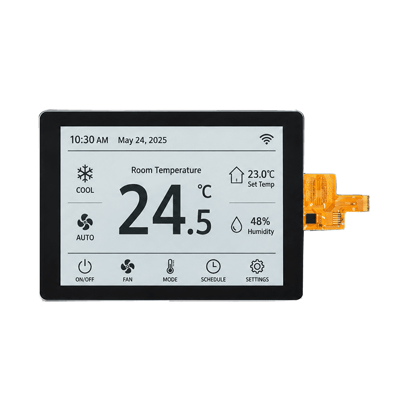

<p align="left"></p>

<h1 align="center">OSPTEK 4.2″ LCD 300×400 (ST7305 · SPI)</h1>

<p align="center"><b>Reflective LCD · SPI · ST7305</b></p>

<p align="center"><a href="./README.md">简体中文</a> | English</p>

<p align="center">
  
  
  
  
</p>

<p align="center"></p>

## Contents

- [Overview](#overview)
- [Specifications](#specifications)
- [Sample projects](#sample-projects)
- [Repository layout](#repository-layout)
- [Resources](#resources)
- [Buy](#buy)
- [Support](#support)

---

## Overview

OSPTEK **4.2″ 300×400 reflective LCD** is a **SPI** monochrome display module driven by **ST7305**, with touch driven by **FT3269**. Suited to low-power instruments, labels, and outdoor-readable UIs.

Spec ID (repository name): `4.2-lcd-300x400-spi-st7305`

Current module version: **YDP420HT004-V3**. Electrical and mechanical details follow [`docs/YDP420HT004-V3_外形图.pdf`](./docs/YDP420HT004-V3_%E5%A4%96%E5%BD%A2%E5%9B%BE.pdf) and the driver IC datasheet.

## Specifications

| Item | Spec |
| ---- | ---- |
| Size | 4.2 inch |
| Type | Reflective LCD (monochrome) |
| Resolution | 300×400 |
| Interface | SPI |
| Driver IC | ST7305 |
| Touch driver | FT3269 |

> Full outline, FPC definition, power, and timing follow the product datasheet / driver IC datasheet.

## Sample projects

| Description | Path |
| ---- | ---- |
| ESP32-S3 · ST7305 SPI bring-up (optional FT3269 touch draw-dot) | [`examples/esp32s3-4.2-tft-300x400-spi-st7305-bringup/`](./examples/esp32s3-4.2-tft-300x400-spi-st7305-bringup/) |

## Repository layout

```text
4.2-lcd-300x400-spi-st7305/
├── README.md
├── README_EN.md
├── MODULE_VERSION.md
├── LICENSE
├── images/          # README assets
├── docs/            # outline drawing, datasheets, adapter board, etc.
└── examples/        # sample projects
```

## Resources

### Product files

| Resource | Link |
| ---- | ---- |
| Outline drawing (YDP420HT004-V3) | [`docs/YDP420HT004-V3_外形图.pdf`](./docs/YDP420HT004-V3_%E5%A4%96%E5%BD%A2%E5%9B%BE.pdf) |
| Driver IC datasheet (ST7305) | [`docs/ST_7305_V0_2_d0b99d9cdb.pdf`](./docs/ST_7305_V0_2_d0b99d9cdb.pdf) |
| 2.9 / 4.2″ TP combo adapter board schematic | [`docs/SCH_2.9&4.2TP二合一转接板.pdf`](./docs/SCH_2.9%264.2TP%E4%BA%8C%E5%90%88%E4%B8%80%E8%BD%AC%E6%8E%A5%E6%9D%BF.pdf) |

### Samples

- [ESP32-S3 ST7305 SPI bring-up](./examples/esp32s3-4.2-tft-300x400-spi-st7305-bringup/)

## Buy

<p align="center">
  <a href="https://www.aliexpress.com/store/1105701619"></a>
  &nbsp;&nbsp;
  <a href="https://shop110742373.taobao.com/"></a>
</p>

**Overseas (AliExpress)**

- Store: [OSPTEK Official Store](https://www.aliexpress.com/store/1105701619)

**China (Taobao)**

- Store: [鱼鹰光电工厂店](https://shop110742373.taobao.com/)

## Support

- Technical support / product inquiry: <luyu@osptek.com>
- QQ group: **985881096**
- Website: <https://osptek.com/>
- Feel free to open an Issue in this repository with any questions

---

<p align="center"><sub>© 2026 OSPTEK · Materials in this repository are licensed under CC BY 4.0</sub></p>
